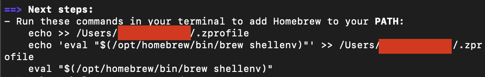

This two step guide explains how to install **FFmpeg** and **ImageMagick** on macOS using [Homebrew](https://brew.sh/).

<Steps>

  <Step title="Step 1: Install Homebrew (if not already installed)">
    First, check if Homebrew is installed by running the following command in your terminal:
    ```bash
    brew --version
    ```

    If Homebrew is not installed, you can install it using the following command:
    ```bash
    /bin/bash -c "$(curl -fsSL https://raw.githubusercontent.com/Homebrew/install/HEAD/install.sh)"
    ```

    After installation, if you're prompted to add Homebrew to your system `PATH`, **copy the provided command** and run it with `sudo`. You may see something like this:
    
    

    For more detailed instructions, visit the [Homebrew Installation Guide](https://brew.sh).
  </Step>
  
  <Step title="Step 2: Install FFmpeg and ImageMagick">
    Once Homebrew is installed and correctly added to your system's `PATH`, you can install **FFmpeg** and **ImageMagick** with the following command:
    ```bash
    brew install ffmpeg imagemagick
    ```

    FFmpeg is a powerful tool for working with video and audio, and ImageMagick is used for image processing. This command will install both utilities at once.
  </Step>
  
  <Step title="Step 3: Verify Installation">
    After the installation completes, verify that both tools are installed by checking their versions:
    ```bash
    ffmpeg -version
    magick -version
    ```

    You should see version information for FFmpeg and ImageMagick, confirming that they were installed successfully.
  </Step>
  
</Steps>

## You're All Set!

Now that both **FFmpeg** and **ImageMagick** are installed, you’re ready to start using them in your projects!